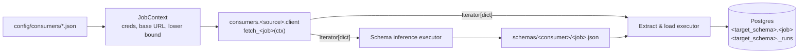

# elt-suite

[](https://github.com/jpsalter000/elt-suite/actions/workflows/ci.yml)

A small, config-driven extract-and-load framework. Each **consumer** (one company's integration with one source system, such as `abc_salesforce_extract_and_load`) is described by a JSON config. Two generic executors run any consumer's jobs:

- **Schema inference** runs a job to completion, infers a type for every record, widens types where it can and fails on incompatible ones, then writes a JSON schema per job.
- **Full extract and load** runs a job to completion and upserts it into the configured Postgres destination. Incremental jobs resume from where the last successful run stopped. Every record is stamped with the run's `run_id`, and every run is recorded in a `_runs` table.

Neither executor knows anything about Salesforce or NetSuite. Each one calls a source-specific **fetch function** through a small contract, so a new source only has to implement that contract.



## Layout

```
config/
  destinations.json                     # named destinations -> DSN env var
  consumers/<company>_<source>_extract_and_load.json
schemas/<consumer>/<job>.json           # generated by `elt infer`
src/elt_suite/
  config.py                             # pydantic config models
  contract.py                           # JobContext + fetch-function resolution
  inference/                            # type lattice + inference executor
  load/                                 # DDL mapping, Destination protocol, Postgres, executor
  cli.py
src/consumers/
  salesforce/client.py                  # fetch_contacts, fetch_accounts, fetch_opportunities
  netsuite/client.py                    # fetch_customers, fetch_transactions
  usgs/client.py                        # fetch_earthquakes, fetch_significant_earthquakes (no credentials)
  shopfront/client.py                   # fetch_customers, fetch_orders (mock API, OAuth2 + refresh)
  ticketdesk/client.py                  # fetch_tickets, fetch_agents (mock API, API key)
src/mock_apis/                          # two mock REST APIs served by `elt-mock`
  shopfront/  ticketdesk/  cli.py
```

## Consumer config

```json
{
  "company": "abc",
  "source_system": "salesforce",
  "base_url": "https://abc.my.salesforce.com",
  "credentials": { "client_id": "ABC_SF_CLIENT_ID", "client_secret": "ABC_SF_CLIENT_SECRET" },
  "destination": "warehouse",
  "target_schema": "abc_salesforce",
  "extra": { "api_version": "v61.0" },
  "jobs": [
    {
      "name": "contacts",
      "primary_keys": ["Id"],
      "incremental_loading": {
        "incremental_key": "LastModifiedDate",
        "lower_bound": "2024-01-01T00:00:00.000+0000",
        "datetime_format": "%Y-%m-%dT%H:%M:%S.%f%z"
      }
    }
  ]
}
```

| Field | Purpose |
| --- | --- |
| `company`, `source_system` | Identify the consumer. The file must be named `<company>_<source_system>_extract_and_load.json`. |
| `base_url` | Base API URL shared by all jobs. It may contain `{credential}` placeholders. |
| `credentials` | Maps a logical credential name to the **environment variable** that holds it. Secrets never go in configs. |
| `destination`, `target_schema` | Which destination from `destinations.json` to load into, and which schema to use there. |
| `extra` | Free-form settings for the source client, such as API version or page size. |
| `jobs[]` | `name`, `primary_keys`, and optionally `incremental_loading` (`incremental_key`, `lower_bound`, `datetime_format`) `fetch` (overrides the function name), and `options` (source-specific settings for the job, such as query filters). |

## The consumer contract

For a consumer with `source_system: "salesforce"`, job `contacts` resolves to:

```python
# src/consumers/salesforce/client.py
def fetch_contacts(ctx: JobContext) -> Iterator[dict]: ...
```

The fetch function owns authentication, pagination and incremental filtering. `ctx` provides:

- `ctx.consumer` and `ctx.job`: the parsed config
- `ctx.credentials`: resolved secret values
- `ctx.lower_bound`: the parsed `lower_bound` as a `datetime`
- `ctx.http`: an `httpx.Client` that retries 429 and 5xx responses

The fetch function yields plain dict records. Every company that uses the same source system shares one client module.

**To add a source:** create `src/consumers/<source>/client.py` with one `fetch_<job>` function per job, then add a consumer config.

## Schema inference

```bash
uv run elt infer abc_salesforce_extract_and_load --job contacts
```

| Observed | Result |
| --- | --- |
| `null` with any type | same type, `nullable: true` |
| field missing from some records | `nullable: true` |
| `integer` + `number` | `number` |
| `date` + `date-time` | `date-time` |
| `date`/`date-time` string + free text | `string` |
| objects / arrays | merged recursively (properties / item types) |
| `'abc'` vs `['a','b','c']`, `true` vs `1`, `1` vs `"1"`, … | **error** naming the field path and record number |

Strings are tagged `date` or `date-time` when they are ISO 8601 or match the job's `datetime_format`. Inference also fails if a primary key or the incremental key is never observed, or if a primary key is ever null.

## Full extract and load

```bash
uv run elt run abc_salesforce_extract_and_load                 # all jobs, resuming from state
uv run elt run abc_salesforce_extract_and_load --full-refresh  # re-read from the configured lower_bound
```

A run does the following:

1. It requires `schemas/<consumer>/<job>.json`, which `elt infer` produces.
2. For incremental jobs, it works out the lower bound (see below) and passes it to the fetch function as `ctx.lower_bound`.
3. It generates a `run_id` (UUID) and inserts a row into `<target_schema>._runs` with status `running`, a timestamp, and the `lower_bound` used.
4. It creates the schema and table if they are missing. Column types come from the inferred schema: `BIGINT`, `DOUBLE PRECISION`, `TEXT`, `BOOLEAN`, `DATE`, `TIMESTAMPTZ`, or `JSONB` for objects and arrays. The table also gets `_run_id` and `_loaded_at` columns, and new fields become new columns.
5. It streams records in batches, stamps each one with `_run_id`, and upserts on `primary_keys`. A field missing from the schema fails the run and asks you to re-infer.
6. It updates the `_runs` row to `succeeded` or `failed`, with `finished_at`, `records_loaded`, `max_incremental_value`, and the `error` if there was one.

### Incremental state

The `_runs` table doubles as the state store, so no separate state file or service is needed.

- A run reads from the `max_incremental_value` of the job's most recent **successful** run. If there is no such run, or the configured `lower_bound` is later, it uses the configured `lower_bound`.
- Failed runs never advance the watermark, so a failure is retried from the same point next time.
- The bound is inclusive (`>=`). Records sitting exactly on the boundary are read again and upserted idempotently, so nothing is lost when several records share the same timestamp.
- `--full-refresh` ignores state and re-reads from the configured `lower_bound`.
- Watermarks are stored formatted with the job's `datetime_format`, so they parse back the same way.

## Quickstart (no credentials needed)

The `demo_usgs_extract_and_load` consumer reads the public [USGS Earthquake Catalog](https://earthquake.usgs.gov/fdsnws/event/1/), so you can run the whole pipeline without any accounts. All you need is [uv](https://docs.astral.sh/uv/) and Docker.

```bash
uv sync
cp .env.example .env                                  # WAREHOUSE_DSN for the local Postgres
docker compose up -d                                  # Postgres on :5432
uv run elt list
uv run elt infer demo_usgs_extract_and_load           # writes schemas/demo_usgs_extract_and_load/*.json
uv run elt run demo_usgs_extract_and_load             # first run: everything since lower_bound
uv run elt run demo_usgs_extract_and_load             # later runs: only events updated since the last run
```

Then look at the results:

```bash
docker compose exec warehouse psql -U elt -d warehouse -c   "SELECT job, status, records_loaded, lower_bound, max_incremental_value FROM demo_usgs._runs ORDER BY started_at"
```

The earthquake data also shows inference at work. `mag` arrives as both `5` and `4.7` and widens to `number`, `felt` is nullable, `tz` is always null, and the comma-encoded `sources` field becomes `array<string>` (stored as `JSONB`). The generated schemas are committed in [`schemas/demo_usgs_extract_and_load/`](schemas/demo_usgs_extract_and_load/).

The Salesforce and NetSuite consumers work the same way once their credentials are in `.env`.

## Mock APIs

Two mock REST APIs ship with the repo so the harder parts of extraction can be exercised offline and deterministically. Each has seeded data and its own authentication, pagination and error style, and each has a full consumer, config and committed schema.

| | Shopfront (`globex_shopfront`) | Ticketdesk (`initech_ticketdesk`) |
| --- | --- | --- |
| Domain | E-commerce: `customers`, `orders` | Support desk: `tickets`, `agents` |
| Auth | OAuth2 client credentials; short-lived bearer tokens; single-use rotating refresh tokens | Static key in the `X-API-Key` header |
| Pagination | Keyset cursor in the body (`pagination.next_cursor`, `has_more`) | `page`/`per_page` with `Link` (`rel="next"`, `rel="last"`) and `X-Total-Count` headers |
| Incremental filter | `updated_since`, ISO 8601 with timezone, **inclusive** | `modified_after`, `YYYY-MM-DD HH:MM:SS` UTC, **exclusive** |
| Errors | `400 {"error": {"code", "message", "details": [{"param", "message"}]}}` | `422 {"message", "errors": [{"field", "message"}]}` |
| Local port | 8001 | 8002 |

Every invalid parameter is reported at once, with the accepted values or format. For example, `GET /v1/orders?limit=0&updated_since=yesterday` returns:

```json
{"error": {"code": "invalid_parameters", "message": "2 invalid parameters: limit, updated_since",
  "details": [
    {"param": "limit", "message": "must be between 1 and 100; got 0"},
    {"param": "updated_since", "message": "must be an ISO 8601 timestamp with a timezone, e.g. 2026-05-01T00:00:00Z; got 'yesterday'"}]}}
```

**What the consumers handle:**

- **Shopfront:** when an access token expires partway through pagination, the client exchanges the refresh token and retries the page. If the refresh token is rejected, it re-authenticates from scratch.
- **Ticketdesk:** `modified_after` is exclusive, timestamps have one-second resolution, and several tickets share each hourly `modified_at`. Passing the watermark as-is would silently drop records, so the client sends `lower_bound - 1s` to keep elt-suite's inclusive semantics. A test pins this with colliding timestamps.
- **Both:** API errors surface as `SourceError` with the API's own explanation. For example: `Shopfront token request (client_credentials) failed: 401 invalid_client: client_id or client_secret is incorrect`.

Run them locally (the demo credentials are in `.env.example`):

```bash
uv run elt-mock shopfront        # http://localhost:8001/docs
uv run elt-mock ticketdesk       # http://localhost:8002/docs
uv run elt run globex_shopfront_extract_and_load
uv run elt run initech_ticketdesk_extract_and_load
```

## Development

This repo is **test-first**. Every change starts with a failing test, and the commit history shows it: each feature lands as a `test:` commit that specifies it, followed by the `feat:` commit that makes it pass. API tests cover three cases: valid queries that return data, valid queries that return nothing, and invalid queries, which must produce a helpful error.

```bash
uv run pytest               # fake consumer, mocked USGS, and both mock APIs served in-process
uv run ruff check . && uv run ruff format --check .
uv run pyright
```

The Postgres end-to-end test is marked `integration`. It runs when `WAREHOUSE_DSN` is set, for example after `docker compose up -d`.

[CI](.github/workflows/ci.yml) runs on every push and pull request in two jobs:

- **checks:** ruff, pyright, and the full test suite against a Postgres service container, so the integration test always runs.
- **demo:** runs the live USGS pipeline and both mock-API pipelines twice each into a fresh Postgres, using the committed schemas. This shows the second run resuming from the first run's watermark, and it catches drift between the committed schemas and the live data. The resulting `_runs` table is posted to the job summary.
