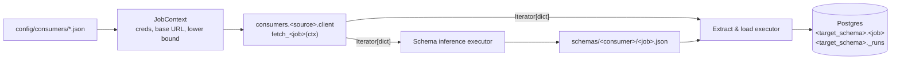
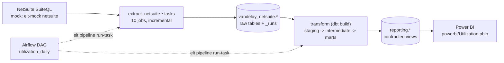
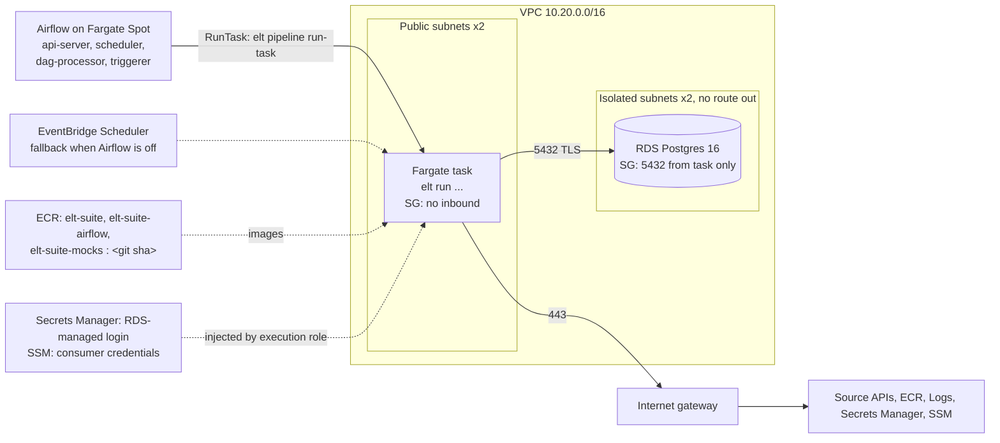

# elt-suite

[](https://github.com/jpsalter000/elt-suite/actions/workflows/ci.yml)

A small, config-driven extract-and-load framework. Each **consumer** (one company's integration with one source system, such as `abc_salesforce_extract_and_load`) is described by a JSON config. Two generic executors run any consumer's jobs:

- **Schema inference** runs a job to completion, infers a type for every record, widens types where it can and fails on incompatible ones, then writes a JSON schema per job.
- **Full extract and load** runs a job to completion and upserts it into the configured Postgres destination. Incremental jobs resume from where the last successful run stopped. Every record is stamped with the run's `run_id`, and every run is recorded in a `_runs` table.

Neither executor knows anything about Salesforce or NetSuite. Each one calls a source-specific **fetch function** through a small contract, so a new source only has to implement that contract.

On top of that, **pipelines** chain extract-and-load jobs with a **dbt** project that transforms the raw tables into Postgres views. The pipelines are orchestrator-agnostic: Airflow runs them through a thin adapter, and so can anything else that can run a container. The first pipeline is the [utilization reporting pipeline](#utilization-reporting-pipeline): NetSuite to Postgres views to Power BI, replacing a weekly Excel and VBA process.



## Layout

```
config/
  destinations.json                     # named destinations -> DSN env var
  consumers/<company>_<source>_extract_and_load.json
  pipelines/<name>.json                 # extract_load + dbt steps (e.g. utilization_daily)
schemas/<consumer>/<job>.json           # generated by `elt infer`
src/elt_suite/
  config.py                             # pydantic config models
  contract.py                           # JobContext + fetch-function resolution
  inference/                            # type lattice + inference executor
  load/                                 # DDL mapping, Destination protocol, Postgres, executor
  pipeline/                             # pipeline config, planning, task execution, dbt runner
  cli.py
src/consumers/
  salesforce/client.py                  # fetch_contacts, fetch_accounts, fetch_opportunities
  netsuite/client.py                    # SuiteQL: employees, projects, time entries, transactions, ...
  usgs/client.py                        # fetch_earthquakes, fetch_significant_earthquakes (no credentials)
  shopfront/ ticketdesk/ cartwheel/ helpline/   # clients for the mock vendor APIs
src/mock_apis/                          # five mock REST APIs served by `elt-mock`
  shopfront/ ticketdesk/ cartwheel/ helpline/ netsuite/ cli.py
transform/                              # dbt project: staging -> intermediate -> marts -> reporting views
orchestration/airflow/                  # Airflow adapter (DAGs from pipeline graphs), image, bootstrap
powerbi/                                # Power BI project (TMDL model + PBIR report), generated from dbt contracts
infra/
  modules/{network,registry,warehouse,runner,airflow}/   # Terraform modules, each with `terraform test`
  envs/dev/                             # root module: composes the modules, S3 backend
Dockerfile                              # multi-stage uv build -> non-root runtime image (+ mocks image)
```

## Consumer config

```json
{
  "company": "abc",
  "source_system": "salesforce",
  "base_url": "https://abc.my.salesforce.com",
  "credentials": { "client_id": "ABC_SF_CLIENT_ID", "client_secret": "ABC_SF_CLIENT_SECRET" },
  "destination": "warehouse",
  "target_schema": "abc_salesforce",
  "extra": { "api_version": "v61.0" },
  "jobs": [
    {
      "name": "contacts",
      "primary_keys": ["Id"],
      "incremental_loading": {
        "incremental_key": "LastModifiedDate",
        "lower_bound": "2024-01-01T00:00:00.000+0000",
        "datetime_format": "%Y-%m-%dT%H:%M:%S.%f%z"
      }
    }
  ]
}
```

| Field | Purpose |
| --- | --- |
| `company`, `source_system` | Identify the consumer. The file must be named `<company>_<source_system>_extract_and_load.json`. |
| `base_url` | Base API URL shared by all jobs. It may contain `{credential}` placeholders. |
| `credentials` | Maps a logical credential name to the **environment variable** that holds it. Secrets never go in configs. |
| `destination`, `target_schema` | Which destination from `destinations.json` to load into, and which schema to use there. |
| `extra` | Free-form settings for the source client, such as API version or page size. |
| `jobs[]` | `name`, `primary_keys`, and optionally `incremental_loading` (`incremental_key`, `lower_bound`, `datetime_format`) `fetch` (overrides the function name), and `options` (source-specific settings for the job, such as query filters). |

## The consumer contract

For a consumer with `source_system: "salesforce"`, job `contacts` resolves to:

```python
# src/consumers/salesforce/client.py
def fetch_contacts(ctx: JobContext) -> Iterator[dict]: ...
```

The fetch function owns authentication, pagination and incremental filtering. `ctx` provides:

- `ctx.consumer` and `ctx.job`: the parsed config
- `ctx.credentials`: resolved secret values
- `ctx.lower_bound`: the parsed `lower_bound` as a `datetime`
- `ctx.http`: an `httpx.Client` that retries 429 and 5xx responses

The fetch function yields plain dict records. Every company that uses the same source system shares one client module.

**To add a source:** create `src/consumers/<source>/client.py` with one `fetch_<job>` function per job, then add a consumer config.

## Schema inference

```bash
uv run elt infer abc_salesforce_extract_and_load --job contacts
```

| Observed | Result |
| --- | --- |
| `null` with any type | same type, `nullable: true` |
| field missing from some records | `nullable: true` |
| `integer` + `number` | `number` |
| `date` + `date-time` | `date-time` |
| `date`/`date-time` string + free text | `string` |
| objects / arrays | merged recursively (properties / item types) |
| `'abc'` vs `['a','b','c']`, `true` vs `1`, `1` vs `"1"`, … | **error** naming the field path and record number |

Strings are tagged `date` or `date-time` when they are ISO 8601 or match the job's `datetime_format`. Inference also fails if a primary key or the incremental key is never observed, or if a primary key is ever null.

## Full extract and load

```bash
uv run elt run abc_salesforce_extract_and_load                 # all jobs, resuming from state
uv run elt run abc_salesforce_extract_and_load --full-refresh  # re-read from the configured lower_bound
```

A run does the following:

1. It requires `schemas/<consumer>/<job>.json`, which `elt infer` produces.
2. For incremental jobs, it works out the lower bound (see below) and passes it to the fetch function as `ctx.lower_bound`.
3. It generates a `run_id` (UUID) and inserts a row into `<target_schema>._runs` with status `running`, a timestamp, and the `lower_bound` used.
4. It creates the schema and table if they are missing. Column types come from the inferred schema: `BIGINT`, `DOUBLE PRECISION`, `TEXT`, `BOOLEAN`, `DATE`, `TIMESTAMPTZ`, or `JSONB` for objects and arrays. The table also gets `_run_id` and `_loaded_at` columns, and new fields become new columns.
5. It streams records in batches, stamps each one with `_run_id`, and upserts on `primary_keys`. A field missing from the schema fails the run and asks you to re-infer.
6. It updates the `_runs` row to `succeeded` or `failed`, with `finished_at`, `records_loaded`, `max_incremental_value`, and the `error` if there was one.

### Incremental state

The `_runs` table doubles as the state store, so no separate state file or service is needed.

- A run reads from the `max_incremental_value` of the job's most recent **successful** run. If there is no such run, or the configured `lower_bound` is later, it uses the configured `lower_bound`.
- Failed runs never advance the watermark, so a failure is retried from the same point next time.
- The bound is inclusive (`>=`). Records sitting exactly on the boundary are read again and upserted idempotently, so nothing is lost when several records share the same timestamp.
- `--full-refresh` ignores state and re-reads from the configured `lower_bound`.
- Watermarks are stored formatted with the job's `datetime_format`, so they parse back the same way.

## Quickstart (no credentials needed)

The `demo_usgs_extract_and_load` consumer reads the public [USGS Earthquake Catalog](https://earthquake.usgs.gov/fdsnws/event/1/), so you can run the whole pipeline without any accounts. All you need is [uv](https://docs.astral.sh/uv/) and Docker.

```bash
uv sync
cp .env.example .env                                  # WAREHOUSE_DSN for the local Postgres
docker compose up -d                                  # Postgres on :5432
uv run elt list
uv run elt infer demo_usgs_extract_and_load           # writes schemas/demo_usgs_extract_and_load/*.json
uv run elt run demo_usgs_extract_and_load             # first run: everything since lower_bound
uv run elt run demo_usgs_extract_and_load             # later runs: only events updated since the last run
```

Then look at the results:

```bash
docker compose exec warehouse psql -U elt -d warehouse -c   "SELECT job, status, records_loaded, lower_bound, max_incremental_value FROM demo_usgs._runs ORDER BY started_at"
```

The earthquake data also shows inference at work. `mag` arrives as both `5` and `4.7` and widens to `number`, `felt` is nullable, `tz` is always null, and the comma-encoded `sources` field becomes `array<string>` (stored as `JSONB`). The generated schemas are committed in [`schemas/demo_usgs_extract_and_load/`](schemas/demo_usgs_extract_and_load/).

The Salesforce and NetSuite consumers work the same way once their credentials are in `.env`.

## Utilization reporting pipeline

This pipeline recreates a reporting process that began as a weekly, hand-run Excel workbook: VBA macros, a Power Pivot model and DAX. It is now a daily service. It ingests NetSuite through the API, transforms the data in dbt-managed Postgres views, and supplies reporting datasets to Power BI.



```bash
docker compose up -d && uv run elt-mock netsuite &      # warehouse + NetSuite mock
set -a && . ./.env.example && set +a                    # demo credentials
uv run elt pipeline list                                # utilization_daily: 10 extract tasks + transform
uv run elt pipeline run utilization_daily               # extract every job, then dbt build
docker compose exec warehouse psql -U elt -d warehouse -c \
  "SELECT employee_name, week_start, net_utilization_pct FROM reporting.rpt_utilization_weekly LIMIT 5"
```

Or run it under Airflow: `docker compose --profile airflow up -d --build`, then unpause and trigger `utilization_daily` at http://localhost:8080 (admin / admin).

- **Logic:** every rule is taken from the workbook, with deliberate improvements. Examples: a full calendar, released staff kept in history, expected hours floored at zero, and pass-through revenue no longer subtracted twice. dbt unit tests pin each rule. An integration test compares every employee-week and every project against an independent Python implementation.
- **Orchestration:** every task runs with `elt pipeline run-task <pipeline> <task>`, and `elt pipeline export` writes the task graphs. The Airflow adapter (`orchestration/airflow`) turns those graphs into DAGs, with ECS and local runners; any other orchestrator can wrap the same contract.
- **Power BI:** `powerbi/Utilization.pbip` is generated from the dbt reporting contracts (`uv run python powerbi/generate.py`). It connects as the `powerbi` login, which can read only the `reporting` schema.

## Mock APIs

Four mock REST APIs ship with the repo so the hard parts of extraction and normalization can be exercised offline and deterministically. They form two domains, and each domain has **two vendors that deliver the same kinds of records in different shapes**. Each API has seeded data, its own authentication, pagination and error style, and a full consumer, config and committed schema.

| | Shopfront | Cartwheel | Ticketdesk | Helpline |
| --- | --- | --- | --- | --- |
| Domain (tenant) | Commerce (`globex`) | Commerce (`umbrella`) | Support (`initech`) | Support (`hooli`) |
| Records | `customers`, `orders` (line items nested) | `customers`, `orders`, `order-items` | `tickets`, `agents` | `cases`, `staff` |
| Auth | OAuth2 client credentials, rotating single-use refresh tokens | HTTP Basic | `X-API-Key` header | HMAC-SHA256 signed requests, 300s replay window |
| Pagination | Keyset cursor in the body | `offset`/`limit`, `total` in the body; the default sort is unstable | `page`/`per_page` + `Link` / `X-Total-Count` | Changes feed: `start_time`, then `since_token` |
| Incremental filter | `updated_since`, ISO `Z`, inclusive | `modified_since`, unix seconds, inclusive | `modified_after`, naive UTC, **exclusive** | `start_time`, ISO with offset; **late arrivals** |
| Shape | snake_case, dollars in USD | camelCase, integer cents in USD/EUR/GBP, `Y`/`N`, `""` for null | nested requester, hours | requester email only, `;`-joined labels, minutes, local offsets |
| Deletes | none | soft deletes, hidden by default | none | tombstones |
| Errors | `400 {"error": {code, message, details[]}}` | RFC 7807 `problem+json` | `422 {message, errors[]}` | `400 {ok: false, error, message, problems{}}` |
| Local port | 8001 | 8003 | 8002 | 8004 |

A fifth mock, **NetSuite** (`elt-mock netsuite`, port 8005), serves SuiteQL over REST with token-based auth (OAuth 1.0a HMAC-SHA256) for the utilization pipeline. It parses a subset of SuiteQL and returns values the way SuiteQL does: strings, `T`/`F` flags, account-format dates and omitted nulls. It enforces NetSuite's paging limits.

Each domain's two vendors map onto common `customers` / `orders` / `order_lines` and `tickets` / `agents` models. For example, `IN_TRANSIT` → `shipped`, `P1` → `urgent`, `on_hold` → `pending`, cents → decimal, epoch → `timestamptz`.

Every invalid parameter is reported at once, with the accepted values or format. For example, `GET /v1/orders?limit=0&updated_since=yesterday` on Shopfront returns:

```json
{"error": {"code": "invalid_parameters", "message": "2 invalid parameters: limit, updated_since",
  "details": [
    {"param": "limit", "message": "must be between 1 and 100; got 0"},
    {"param": "updated_since", "message": "must be an ISO 8601 timestamp with a timezone, e.g. 2026-05-01T00:00:00Z; got 'yesterday'"}]}}
```

**What the consumers handle:**

- **Shopfront:** when an access token expires partway through pagination, the client exchanges the refresh token and retries the page. If the refresh token is rejected, it re-authenticates from scratch.
- **Ticketdesk:** `modified_after` is exclusive, timestamps have one-second resolution, and several tickets share each hourly `modified_at`. Passing the watermark as-is would silently drop records, so the client sends `lower_bound - 1s`.
- **Cartwheel:** paging the default sort duplicated 4 orders and skipped 4 others out of 434 (at `limit=7`), so the client always pages with `sort=id`. It also requests soft-deleted rows so deletions reach the warehouse. Watermarks are unix seconds (`datetime_format: "epoch"`).
- **Helpline:** changes commit up to 25 minutes after their `updated_at`, so a change can arrive after the previous run already saved a newer watermark. The consumer config sets `lookback_seconds: 1800`, and a test constructs exactly that case: the change is lost with no look-back and caught with it.
- **All:** API errors surface as `SourceError` with the API's own explanation. For example: `Cartwheel GET /api/v3/orders failed: 401 Unauthorized: username or password is incorrect`.

Run them locally (the demo credentials are in `.env.example`):

```bash
uv run elt-mock shopfront        # http://localhost:8001/docs
uv run elt-mock ticketdesk       # http://localhost:8002/docs
uv run elt-mock cartwheel        # http://localhost:8003/docs
uv run elt-mock helpline         # http://localhost:8004/docs
uv run elt run umbrella_cartwheel_extract_and_load
```

## Deploying to AWS

The pipeline runs as a Fargate task. Terraform in [`infra/`](infra/) defines everything it needs, and CI deploys it on every merge to `main`.



| Module | What it creates |
| --- | --- |
| `network` | VPC, 2 public and 2 isolated subnets, internet gateway, route tables (isolated has no routes), task and database security groups, NACLs mirroring them, an emptied default security group, and flow logs of rejected traffic. **No NAT Gateway**: tasks get public IPs and a security group with no inbound rules, which saves about $33 a month. |
| `registry` | ECR repository with immutable tags, scan on push, encryption, and a lifecycle rule keeping 10 images. |
| `warehouse` | RDS Postgres 16 (`db.t4g.micro`, 20 GB gp3), private, encrypted, TLS-only. RDS generates the password and keeps it in Secrets Manager, so it never appears in Terraform state. |
| `runner` | ECS cluster (with Fargate Spot capacity), a 14-day log group, and a hardened Fargate task definition: non-root, read-only root filesystem, writable `/tmp` only. It has a least-privilege execution role, optional sidecars (dev runs the NetSuite mock this way), and an optional EventBridge schedule. |
| `airflow` | Self-hosted Airflow 3 as one Fargate Spot service: api-server, scheduler, dag-processor and triggerer, with an init container that bootstraps Airflow's own database role. Generated secrets are written write-only, so they never enter state. There is no load balancer and no inbound access; the UI is reached through ECS Exec port forwarding. Its role can only start, watch and stop the elt task. Self-hosted rather than MWAA: about $13 a month on Spot instead of $250 or more plus NAT. |

**Credentials.** The task gets its database login as `PGUSER`/`PGPASSWORD` from the RDS secret. `WAREHOUSE_DSN` holds no secret (`postgresql:///warehouse?sslmode=require`), and libpq fills in the rest. Consumer credentials go in SSM Parameter Store and are mapped to environment variables with `consumer_secrets`.

**CI/CD** ([`ci.yml`](.github/workflows/ci.yml)):

| Trigger | Jobs |
| --- | --- |
| Every push and PR | `checks` (ruff, pyright, pytest + Postgres, including the dbt end-to-end test), `terraform` (fmt, validate, `terraform test` on mocked AWS), `image` (runtime and mocks images + container smoke tests), `airflow` (adapter tests inside the Airflow image), `demo` |
| PR | `plan`: `terraform plan` for dev, using the read-only OIDC role |
| Merge to `main` | `deploy`: make sure the ECR repos exist → build and push `elt-suite`, `elt-suite-airflow` and `elt-suite-mocks` tagged `<sha>` (tags are immutable) → `terraform apply`, so the task definitions run those images. The job summary prints a ready-to-run `aws ecs run-task` command. |

The AWS jobs skip until the repository variables `AWS_PLAN_ROLE_ARN`, `AWS_APPLY_ROLE_ARN` and `TF_STATE_BUCKET` exist. The AWS setup guide creates the state bucket and roles; add the variables with `gh variable set`. The first `terraform apply` creates the RDS instance, which takes about 10 minutes.

Test the infrastructure locally, no AWS account needed:

```bash
for d in infra/modules/* infra/envs/*; do terraform -chdir=$d init -backend=false && terraform -chdir=$d test; done
```


## Development

This repo is **test-first**. Every change starts with a failing test, and the commit history shows it: each feature lands as a `test:` commit that specifies it, followed by the `feat:` commit that makes it pass. API tests cover three cases: valid queries that return data, valid queries that return nothing, and invalid queries, which must produce a helpful error.

```bash
uv run pytest               # fake consumer, mocked USGS, and every mock API served in-process
uv run ruff check . && uv run ruff format --check .
uv run pyright
(cd transform && uv run dbt build --profiles-dir .)   # dbt unit, generic and singular tests
docker build -f orchestration/airflow/Dockerfile --target test -t elt-suite-airflow:test . \
  && docker run --rm elt-suite-airflow:test          # Airflow adapter tests (inside the image)
```

The Postgres tests are marked `integration`, including the end-to-end utilization test (mock NetSuite → dbt → reporting views vs. a Python oracle). They run when `WAREHOUSE_DSN` is set, for example after `docker compose up -d`.

Beyond deployment (above), [CI](.github/workflows/ci.yml) runs two pipeline jobs on every push and pull request:

- **checks:** ruff, pyright, and the full test suite against a Postgres service container, so the integration test always runs.
- **demo:** runs the live USGS pipeline, the four vendor mock pipelines and the `utilization_daily` pipeline twice each into a fresh Postgres, using the committed schemas. This shows the second run resuming from the first run's watermark, and it catches drift between the committed schemas and the live data. The resulting `_runs` table is posted to the job summary.
