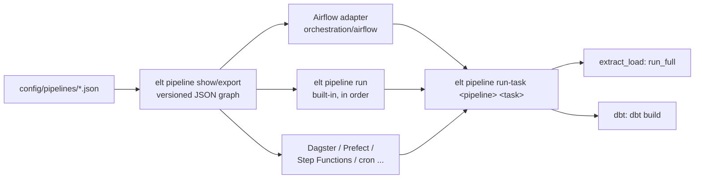

# Orchestration

elt-suite doesn't depend on any orchestrator. A **pipeline** (`config/pipelines/<name>.json`) is a small DAG of steps. elt-suite plans it into **tasks** and can run any task on its own. An orchestrator only has to decide when tasks run, in what order, and where.



## The contract

**1. The graph.** `elt pipeline show <pipeline> --json`, or `elt pipeline export DIR` for every pipeline, prints:

```json
{
  "version": 1,
  "pipeline": "utilization_daily",
  "description": "...",
  "schedule": "0 6 * * *",
  "tasks": [
    {"id": "extract_netsuite.employees", "kind": "extract_load", "depends_on": [],
     "argv": ["pipeline", "run-task", "utilization_daily", "extract_netsuite.employees"]},
    {"id": "transform", "kind": "dbt", "depends_on": ["extract_netsuite.employees", "..."],
     "argv": ["pipeline", "run-task", "utilization_daily", "transform"]}
  ]
}
```

- **Tasks:** an `extract_load` step expands to one task per job, so independent extracts can run in parallel. A `dbt` step is one task.
- **Schedule:** advisory. elt-suite never schedules anything itself.
- **Version:** `version` changes only when the shape changes, so adapters can reject graphs they don't understand.

**2. The task command.** Run `elt <argv>` wherever the elt CLI is installed. This is normally the elt image, whose entrypoint is `elt`.

- **Exit code 0:** the task succeeded.
- **Exit code 1:** the task failed. The reason is on stdout/stderr.
- **Exit code 2:** usage error, such as an unknown pipeline or task.
- **`--json`:** adds a machine-readable result as the last line of output:

  ```json
  {"pipeline": "utilization_daily", "task": "transform", "status": "succeeded",
   "started_at": "...", "finished_at": "...", "detail": {"success": 112, "warn": 1}, "error": null}
  ```

**3. Guarantees that make tasks safe to retry and run in parallel:**

- **Extract tasks** resume from the last successful watermark (or re-read in full for full-refresh jobs). They record every attempt in `<schema>._runs`. Concurrent tasks take a per-schema advisory lock around DDL.
- **dbt tasks** hold a per-pipeline advisory lock. dbt rebuilds views by dropping them with `CASCADE`, so dbt selections must include descendants (`model+`); the pipeline config enforces this.
- **The built-in orchestrator**, `elt pipeline run <pipeline>`, runs tasks in dependency order and skips only the dependents of a failed task.

## Airflow (`orchestration/airflow`)

The adapter (`elt_airflow`) reads exported graphs and builds one DAG per pipeline:
- the same task ids and edges;
- the pipeline's schedule;
- `catchup=False`, `max_active_runs=1`, and one retry.

It never imports elt_suite, so Airflow's constraints and dbt's dependencies never meet. The Airflow image bakes the graphs in at build time (`/opt/elt/graphs`).

| Runner | Operator | Used by |
| --- | --- | --- |
| `EcsRunner` (`ELT_RUNNER=ecs`) | `EcsRunTaskOperator`, deferrable. It starts the elt task definition on Fargate with `command = argv`, streams the task's CloudWatch logs into the Airflow task log, and fails if the container exits non-zero. | AWS (`infra/modules/airflow`) |
| `LocalRunner` (`ELT_RUNNER=local`) | `BashOperator` running `/opt/elt/.venv/bin/elt <argv>`, a separate virtualenv in the Airflow image. | docker compose |

### Locally

```bash
docker compose --profile airflow up -d --build   # warehouse, NetSuite mock, Airflow
# http://localhost:8080  (admin / admin): unpause utilization_daily (new DAGs start paused),
# then trigger it, or from a shell:
docker compose exec airflow-scheduler airflow dags unpause utilization_daily
docker compose exec airflow-scheduler airflow dags trigger utilization_daily
```

The `airflow-init` service runs the same bootstrap as on ECS:
1. Create Airflow's own role and database in the warehouse instance.
2. Migrate.
3. Create the admin user.

### On AWS

`infra/modules/airflow` runs the four Airflow 3 components in one Fargate Spot task, with no load balancer and no inbound rules (ADR 0003). To open the UI, port-forward through ECS Exec:

```bash
cluster=elt-suite-dev
task=$(aws ecs list-tasks --cluster $cluster --service-name elt-suite-dev-airflow --query 'taskArns[0]' --output text)
runtime=$(aws ecs describe-tasks --cluster $cluster --tasks $task \
  --query "tasks[0].containers[?name=='api-server'].runtimeId | [0]" --output text)
aws ssm start-session --target "ecs:${cluster}_${task##*/}_${runtime}" \
  --document-name AWS-StartPortForwardingSession \
  --parameters '{"portNumber":["8080"],"localPortNumber":["8080"]}'
# http://localhost:8080. The admin password is admin_password in the secret named by
# `terraform output airflow_secret_arn`.
```

## Writing another adapter

An adapter reads the graph and maps each task to "run `elt <argv>` somewhere", with `depends_on` as edges. The sketches below assume the elt image, or an environment with `elt` installed.

**Dagster.** One op per task, wired by `depends_on`:

```python
graph = json.load(open("graphs/utilization_daily.json"))
ops = {
    t["id"]: op(name=t["id"].replace(".", "__"))(
        lambda ctx, *_, argv=t["argv"]: subprocess.run(["elt", *argv], check=True)
    )
    for t in graph["tasks"]
}
# build a @job by calling ops in topological order with their upstream outputs as inputs
```

**Prefect.** A flow that submits each task once its dependencies' futures are done:

```python
@task
def run(argv):
    subprocess.run(["elt", *argv], check=True)


@flow
def pipeline(graph):
    futures = {}
    for t in graph["tasks"]:  # graph tasks are already in topological order
        futures[t["id"]] = run.submit(t["argv"], wait_for=[futures[d] for d in t["depends_on"]])
```

**AWS Step Functions.** One `ecs:runTask.sync` state per task, with `ContainerOverrides.Command = argv`. Tasks without mutual dependencies go in a `Parallel` state.

**cron / anything else.** Run `elt pipeline run <pipeline>` with the built-in orchestrator; it's what the runner's EventBridge schedule does when Airflow is off.
